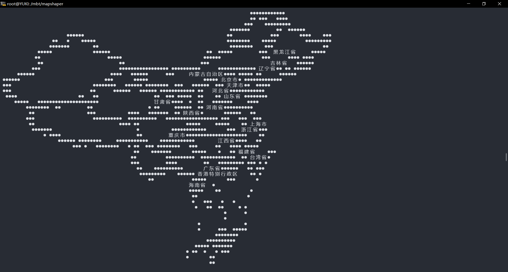

# JqGeoJsonPlot
[简体中文](README.md)|[English](README_EN.md)
JqGeoJsonPlot是一个易于使用的基于jq的地理JSON数据可视化库。它提供了一种简单的方法来在终端中显示地理JSON数据，并能展示文字标签。
## 配置依赖运行示例

使用 MoonBit 包管理器安装：

```bash
moon add moonbitlang/x
```
## 快捷启动
运行./build.sh。若要自行编译，请取消第一行注释。并且更改native-zig的编译路径为自身路径（用别的后端编译也可以）：
```src/main/moon.pkg.json]
"link": {
    "native": {
      "flags": [
        "-cc",
        "/D/zig/zig.exe cc -target riscv64-linux-musl -O2 -static"
        //这里改为自己的zig路径
      ]
    }
  }
```
## 示例
具体代码详见src/main/main.mbt。以下给出图片示例：



