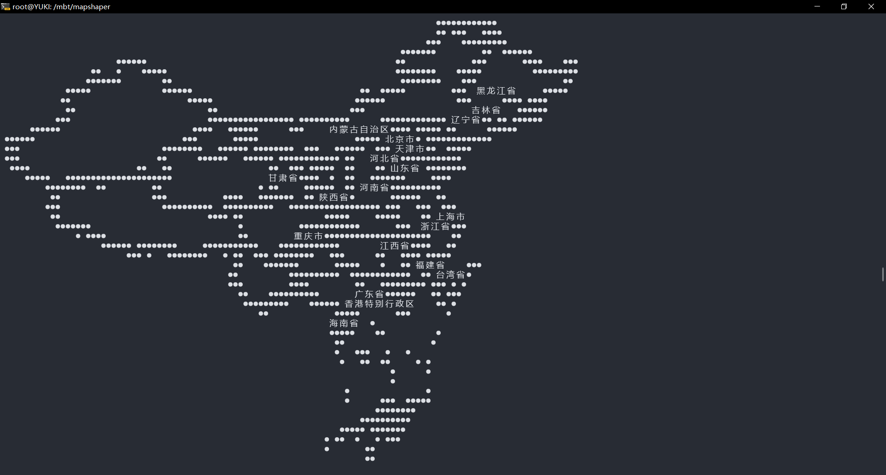
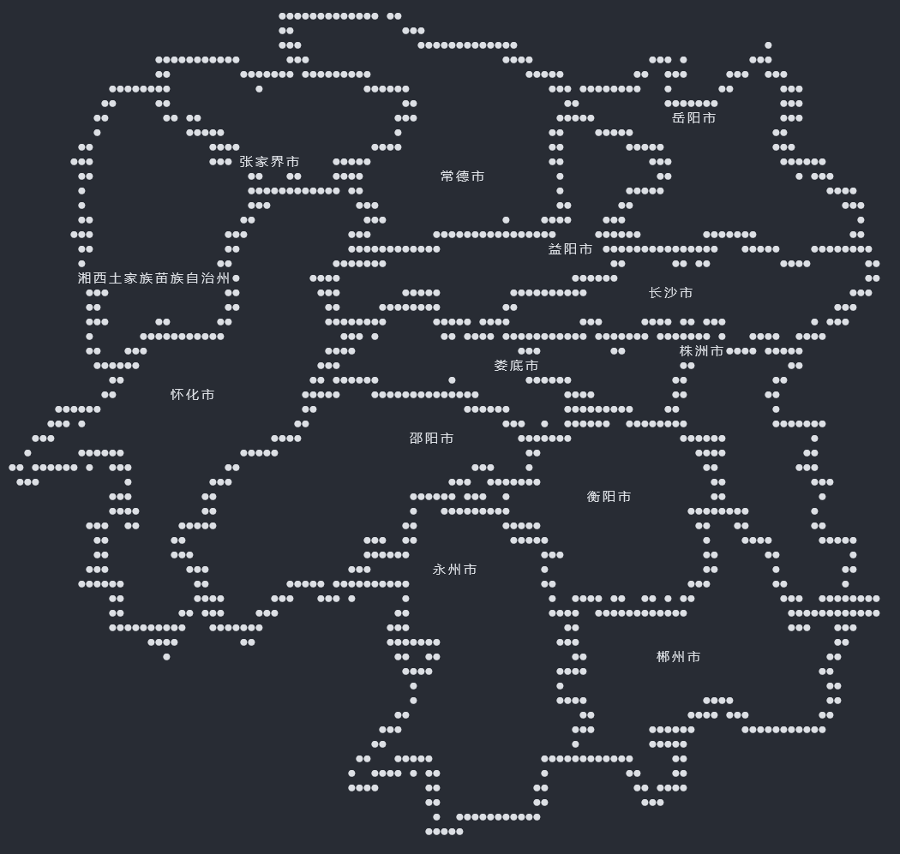

# JqGeoJsonPlot
JqGeoJsonPlot is an easy-to-use jq-based geographic JSON data visualization library. It provides a simple way to display geographic JSON data in the terminal with text labels.

## Installation and Usage
Install using MoonBit package manager:

```bash
moon add moonbitlang/x
```

## Quick Start
Run ./build.sh. To compile manually, uncomment the first line and change the native-zig compilation path to your own path (other backends can also be used):

```src/main/moon.pkg.json]
"link": {
    "native": {
      "flags": [
        "-cc",
        "/D/zig/zig.exe cc -target riscv64-linux-musl -O2 -static"
        // Change to your own zig path here
      ]
    }
  }
```

## Examples
See src/main/main.mbt for detailed code. Here are some image examples:



```